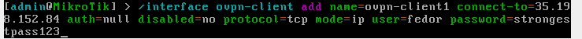

# Lab #1

## Информация

University: [ITMO University](https://itmo.ru/ru/)
Faculty: [FICT](https://fict.itmo.ru)
Course: [Network programming](https://github.com/itmo-ict-faculty/network-programming)
Year: 2023/2024
Group: K34212
Author: Telnov Fedor Nikolaevich
Lab: Lab1
Date of create: 12.10.2024
Date of finished: 12.10.2024

## Прогресс

### Создание VM на платформе Google Cloud

Создается спотовый VM instance, регион сменяется на `europe-west3` - поскольку он находится во Франкфурте,
что обещает более оптимальную скорость подключения:


Выбирается вариация "micro" для экономии средств - излишняя мощность для сетевого подключения все равно без надобности:


Чтобы дополнительно сэкономить средства, меняется тип диска на "standard persistent disk":


Итоговая информация о заказе:


### Установка Ansible на VM

Устанавливается pip:


Устанавливается pipx - он облегчает установку программ, написанных на Python - глобальная установка более не рекомендуется:


Наконец, устанавливается ansible и делается проверка его версии:


### Установка Router OS(CHR) в VirtualBox

Router OS(CHR) скачивается с официального сайта в формате VMDK.
Через пункт New добавляется новая виртуальная машина, причем в качестве диска выбирается скачанный образ:


Далее запускается виртуальная машина и меняется пароль стандартного пользователя admin:


### Настройка OpenVPN-туннеля

На клиенте создается новый интерфейс ovpn-типа с передачей юзернейма и пароля - небезопасная практика, использована только для демонстрации:



Далее инициализируется статический маршрут для нужного ip-адреса пира на необходимый интерфейс и задается NAT-трансляция:


С клиентом готово, теперь необходимо собрать демонстрационный вариант на сервере. Необходимо все же сгенерировать весь необходимый инвентарь для TLS, несмотря на то, что клиент не будет его верифицировать.

Устанавливается openvpn-пакет на удаленном сервере:


Генерируется весь обвяз для TLS:

```
cd /etc/openvpn
make-cadir easy-rsa/
cd easy-rsa/
./easyrsa init-pki
./easyrsa build-ca
./easyrsa build-server-full server
./easyrsa gen-dh
```

Далее создается простой bash-скрипт для аутенфикации клиента в рамках openvpn-сервера. Он просто ищет подходящую строку в файле с логинами и паролями:


Наконец был написан конфиг для сервера, в котором используется TLS-обвяз и нужный скрипт для аутенфикации пользователя:


### Проверка работы туннеля

Сервер запускается с командой `sudo openvpn server.conf` - в логах видно, как подключается клиент:


Далее клиент пингует сервер:


Сервер пингует клиента:


## Выводы

OpenVPN клиент/сервер у RouterOS - какая-то шутка, необходимо постоянно искать паритет между поддерживаемыми фичами
клиента и сервера.
В данном случае из того, что RouterOS был раскатан на VirtualBox, туда было проблематично доставить сертификаты, в результате чего клиенту понадобилась очень тонкая настройка, чтобы избежать любого аспекта TLS.

У OpenVPN можно хорошо подоткнуть собственный метод аутенфикации - даже если это простенький скрипт.
