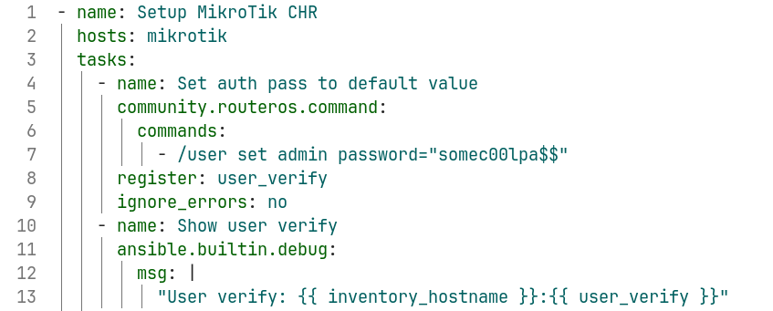

# Lab #2

## Информация

University: [ITMO University](https://itmo.ru/ru/)
Faculty: [FICT](https://fict.itmo.ru)
Course: [Network programming](https://github.com/itmo-ict-faculty/network-programming)
Year: 2023/2024
Group: K34212
Author: Telnov Fedor Nikolaevich
Lab: Lab2
Date of create: 15.02.2024
Date of finished: 15.02.2024

## Прогресс

### Перенос сетапа с первой работы

Так как у меня возникли проблемы с коннектом к гугловому облаку, я перенес сетап облачного провайдера WG на локальную машину, просто создав аналогичную машину в виде VM на соседнем устройстве.

Локальная сеть моего дома выступает как ненадежная сеть интернет для ВМ, поверх которой идет WG-туннель. Настройка аналогична предыдущей работе.

### Настройка дополнительного CHR

Как и в предыдущей работе, завожу новую VM, инициирую WG-Client. На скриншоте представлена конфигурация интерфейсов второго хоста:


Теперь необходимо добавить еще одного WG-пира в конфиг VPN-сервера:

```
[Peer]
PublicKey = h9Bv5EpR3ARfLkPAU5ISJPzEHUxzUuhOwSvBGJa1Fs0=
AllowedIPs = 10.1.1.3/32
```

### Работа с ansible

Я создаю инвентарник, показанный на рисунке ниже. Описываю как индивидуальные per-host переменные, так и общие для корректной работы.
Так как я сгенерил кастомный ключ, отличный от системного и находящегося по нестандартному пути, у меня он Ansible не подгятивается. Поэтому устанавливаю его явно - можно было бы добавить в агента, но у меня с этим возникли трудности.


Далее расписываю основу начальный этап плейбука - устанавливаю "безопасный" пароль хостам, и вывожу дебаг-инфу для проверки:



Добавляю таски для конфигурации NTP, OSPF(skynet - не из терминатора, это мой интернет провайдер), и чтобы собрать получившиеся результаты:


Однако первый запуск у меня не сработал, на новой машине у меня не хватало "ansible-pylibssh", который я поставил с помощью: "pip install ansible-pylibssh". Можно было бы также использовать "paramiko" для интеграции с SSH.

Делаю "ansible -m ping mikrotik" чтобы проверить, что по инвентарнику могу подключиться к хостам группы:


Запускаю плейбук, шаги выполняются успешно, выдается валидный конфиг в дебаг-инфо, содержащий OSPF-параметры:


Далее для проверки собираю информацию об OSPF с микротик-хоста:


## Вывод

В рамках работы была рассмотрена работа с ansible, конфигурация OSPF и NTP на CHR.
С помощью Ansible можно легко конфигурировать множество хостов - без его использования мне, например, пришлось все эти команды вбивать самостоятельно - долго и больно.
