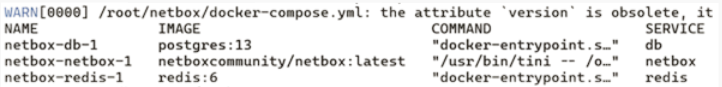

# Lab #3

## Информация

University: [ITMO University](https://itmo.ru/ru/)
Faculty: [FICT](https://fict.itmo.ru)
Course: [Network programming](https://github.com/itmo-ict-faculty/network-programming)
Year: 2023/2024
Group: K34212
Author: Telnov Fedor Nikolaevich
Lab: Lab3
Date of create: 15.02.2024
Date of finished: 15.02.2024

## Прогресс

### Установка софта на доп. VM

Устанавливаю необходимый софт - PG, Redis:

Проверяю, что Redis-сервер доступен:

Клонирую репозиторий netbox:

Завожу пользователя, даю права на директорию, генерю секретный ключ:

Используя предоставляемый docker-compose файл, поднимаю кластер:

В результате удалось зайти на развернутый netbox:

### Добавление CHR

Для добавления устройства в Netbox делаю следующее:

- создаю производителя устройства
- создаю модель
- создаю сайт
- для каждого устройства заполняю интерфейсы и IP-адреса

В результате получаются следующие конфигурации:

CHR-1:

CHR-2:

### Экстракт данных из Netbox

Перед экстрактом я выпускаю токен, а дальше использую плагин Ansible для построения инвентаря:

После вызова команды "ansible-inventory -v --list -y -i extract_inv.yml > netbox_inventory.yml", получился файл "netbox_inventory.yml", прикрепленный в папке с ЛР-3.

### Настройка CHR с помощью ansible

Перед использованием, нужно докинуть параметр "ansible_host" в определения хостов CHR:

Далее я создал плейбук для редактирования параметров CHR:

После отработки плейбука параметры CHR корректно изменились:

Теперь более сложный плейбук, который сначала собирает серийный номер, сохраняет его в переменную, а потом выставляет его в Netbox. В инвентаре serial изначально пустые у хостов. Код плейбука:

## Вывод

В данной работе проведено знакомство с Netbox - системой учета сетевых ресурсов, а также его связкой с Ansible. Интеграция достаточно удобная, позволяет как получить инвентарь в Ansible, так и использовать его для менеджмента машин.
