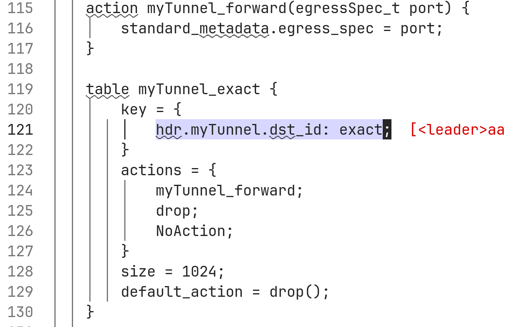

# Lab #4

## Информация

University: [ITMO University](https://itmo.ru/ru/)
Faculty: [FICT](https://fict.itmo.ru)
Course: [Network programming](https://github.com/itmo-ict-faculty/network-programming)
Year: 2023/2024
Group: K34212
Author: Telnov Fedor Nikolaevich
Lab: Lab4
Date of create: 15.02.2024
Date of finished: 15.02.2024

## Прогресс

### Подготовка

Я посмотрел на спецификацию языка P4: https://p4.org/p4-spec/docs/P4-16-v1.2.4.html

По сути это C-подобный DSL для описания работы с данными на программируемых сетевых устройствах.
Далее я поставил vagrant для разворачивания среды, склонировал репо с туториалами и развернул тестовый стенд:

```
git clone https://github.com/p4lang/tutorials.git
cd tutorials/vm-ubuntu-20.04
vagrant up
```

### Basic Forwarding

Мне нужно "починить" свитч, чтобы он корректно обрабатывал пакеты, а не отбрасывал их. У меня были изначально ошибки компиляции при `make run`, может так в задании и задумано. После фиксов запустилось.
Выполняю `pingall` - все пакеты падают, как и должно быть из условия.


Далее я отредактировал парсер по следующей схеме: извлекаются заголовки Ethernet в рамках начального состояния, потом перевожу на парсинг IpV4, и потом на стейт принятия пакета. Отредактированный код:


Далее нужно разобраться с входящим трафиком - реализую обработчик ipv4_forward, отвечающий за переадресацию - включая обработку TTL:


Также нужно добавить валидацию IpV4:


Тест получившегося пайплайна: `make stop && make clean && make build && make run`
Повторяю `pingall`, подключения проходят:


### Basic Tunneling

Надо добавить кастомную логику туннелирования через `myTunnel_t`, используя поле `dst_id`.

Работаю в файле "basic_tun.p4", исправляю парсер для поддержки новой схемы:


Добавляю таблицу маршрутизации по dst_id:



Встраиваю новую логику туннелирования в депарсер:


Тестирую с запущенным "./receive.py" на h2, с h1 откидываю сообщение, оно доходит:


Теперь тестирую с туннелированием, dst_id = 2 - `./send.py 10.0.2.2 "P4 is cool" --dst_id 2`, пакет приходит:


А теперь я меняю адресата, но оставляю dst_id = 2 - `./send.py 10.0.3.3 "P4 is cool" --dst_id 2`, пакет приходит **на H2**:


Это демонстрирует корректность реализации кастомной логики маршрутизации - получатель пакета был изменен в соответствии с программной реализацией.

### Выводы

В ходе работы был изучен язык P4 для программного описания кастомной логики обработки сетевого трафика на программируемых сетевых устройствах. С его помощью удалось реализовать кастомную логику туннелирования.
